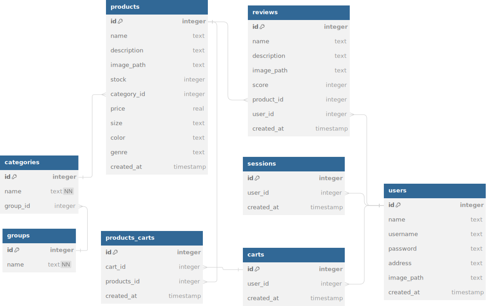

# GAF Backend


An ecommerce web app. Built with typescript, node deployed on AWS. Tested with POSTMAN.

## Table of Contents

- [Functionality](#functionality)
- [Installation](#installation)
- [Usage](#usage)
- [API Endpoints](#api-endpoints)
- [DB Diagram](#db-diagram)
<!-- - [Testing](#testing)
- [Contributing](#contributing)
- [License](#license) -->

## Functionality

- See all products
- Search products
- Add to cart

## Installation

1.  **Clone the repository:**

    ```sh
    git clone
    cd
    ```

2.  **Install dependencies:**

    ```sh
    npm install
    ```

3.  **Set up environment variables:**

    Create a `.env` file in the root directory and add your configuration settings.

    ```env
    PORT=3000
    DB_FILE=gaf_database.sqlite
    ```
    
4.  **Create and Seed the database:**

    ```
    node database/db.js
    node database/seed.js
    ```

## Usage

### Running the Server

To start the server, use the following command:

```sh
npm start
```

The server will run on the port specified in the `.env` file. If no port is specified, it will default to `3000`.

### API Endpoints

## Products:

- `GET /products` - Retrieve a list of all available products
- `GET /products/random` - Retrieve details of a specific product with ID 123
- `GET /products/` - Search (Request body: `['iphone']`) Hardcoded at present.
- `GET /product/123` - Retrieve details of a specific product with ID 123
- `DELETE /product/123` - Deletes a specific product with ID 123

<!-- ## Cart:

- `POST /cart` - Add a new item to the user's shopping cart
- `PUT /cart/123` - Update the quantity of an item with ID 123 in the user's shopping cart
- `DELETE /cart/123` - Remove an item with ID 123 from the user's shopping cart

## Orders:

- `POST /orders` - Create a new order from the user's shopping cart
- `GET /orders/123` - Retrieve the details of a specific order with ID 123

## User Sessions:

- `POST /login` - Authenticate a user and create a new session (`Request body: { email, password }`)
- `GET /me` - Retrieve the currently logged-in user's information
- `POST /logout` - Log out the current user and invalidate their session
- `POST /register` - Create a new user account (Request body: `{ name, email, password }`)
- `PUT /user/:id` - Update the currently logged-in user's information -->

## DB Diagram


